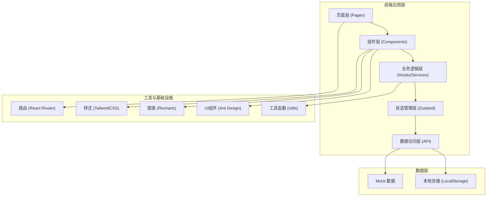
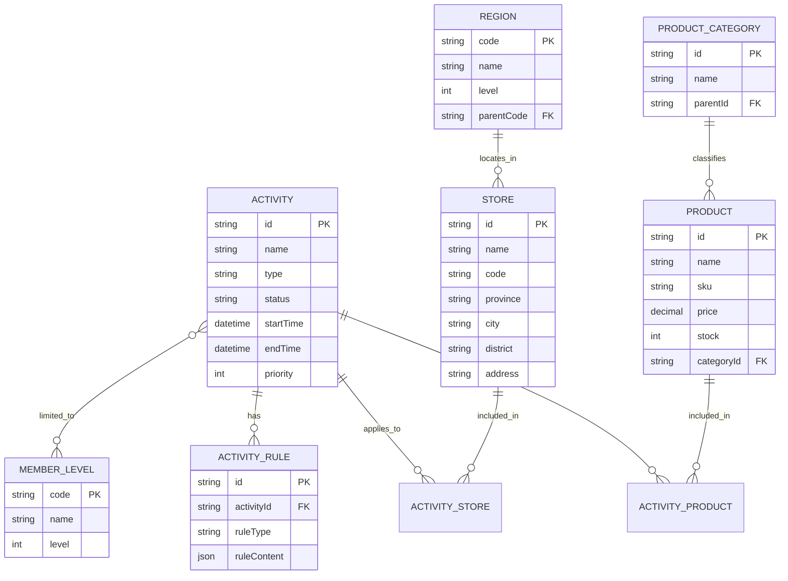

## 1. 架构设计

本项目采用纯前端 SPA 架构，使用 React 18 + TypeScript + Vite 构建，数据层通过 Mock 数据模拟，便于后续接入真实后端 API。整体架构遵循分层设计原则，确保代码可维护性和扩展性。



## 2. 技术栈描述

### 2.1 核心技术

- **前端框架**: React@18.2.0 - 使用函数式组件 + Hooks
- **开发语言**: TypeScript@5.0 - 严格类型检查
- **构建工具**: Vite@5.0 - 快速开发与构建
- **路由管理**: React Router@6.0 - 声明式路由
- **状态管理**: Zustand@4.0 - 轻量级状态管理
- **UI 组件库**: Ant Design@5.0 - 企业级 UI 组件
- **样式方案**: TailwindCSS@3.4 - 原子化 CSS
- **图表库**: Recharts@2.10 - 数据可视化
- **图标库**: Lucide React - 精美线性图标

### 2.2 开发工具

- **代码规范**: ESLint + Prettier
- **Git Hooks**: Husky + lint-staged
- **类型检查**: TypeScript Strict Mode
- **包管理器**: pnpm

### 2.3 目录结构

```
src/
├── assets/              # 静态资源
│   ├── images/
│   └── styles/
├── components/          # 公共组件
│   ├── layout/         # 布局组件
│   ├── ui/             # 基础 UI 组件
│   └── business/       # 业务组件
├── pages/               # 页面组件
│   ├── activity-list/
│   ├── activity-edit/
│   ├── product-select/
│   ├── store-scope/
│   └── effect-analysis/
├── store/               # 状态管理
│   ├── useActivityStore.ts
│   └── useUserStore.ts
├── hooks/               # 自定义 Hooks
│   ├── useActivity.ts
│   ├── useProduct.ts
│   └── useStore.ts
├── services/            # API 服务
│   ├── activity.ts
│   ├── product.ts
│   ├── store.ts
│   └── analysis.ts
├── types/               # TypeScript 类型定义
│   ├── activity.ts
│   ├── product.ts
│   ├── store.ts
│   └── analysis.ts
├── mock/                # Mock 数据
│   ├── activity.ts
│   ├── product.ts
│   ├── store.ts
│   └── analysis.ts
├── utils/               # 工具函数
│   ├── format.ts
│   ├── validate.ts
│   └── export.ts
├── router/              # 路由配置
│   └── index.tsx
├── App.tsx
└── main.tsx
```

## 3. 路由定义

| 路由路径 | 页面名称 | 说明 |
|----------|----------|------|
| `/` | 重定向 | 重定向至活动列表 |
| `/activity/list` | 活动列表 | 展示所有活动，支持筛选和批量操作 |
| `/activity/create` | 活动编辑-新建 | 创建新活动的基础信息和规则配置 |
| `/activity/edit/:id` | 活动编辑-修改 | 编辑已有活动 |
| `/activity/:id/products` | 商品选择 | 为指定活动选择参与商品 |
| `/activity/:id/stores` | 门店范围 | 为指定活动配置门店范围 |
| `/activity/:id/analysis` | 效果分析 | 查看指定活动的执行效果 |

### 3.1 导航结构

- 促销管理
  - 活动列表 (`/activity/list`)
  - 新建活动 (`/activity/create`)
- 数据分析
  - 效果分析 (`/activity/analysis`)

## 4. 类型定义

### 4.1 活动相关类型

```typescript
// 活动类型
type ActivityType = 'full_reduction' | 'discount' | 'gift';

// 活动状态
type ActivityStatus = 'draft' | 'pending' | 'approved' | 'active' | 'paused' | 'ended' | 'rejected';

// 会员等级
type MemberLevel = 'normal' | 'silver' | 'gold' | 'platinum' | 'diamond';

// 满减规则
interface FullReductionRule {
  threshold: number;      // 满减门槛
  discount: number;       // 减免金额
}

// 折扣规则
interface DiscountRule {
  discount: number;       // 折扣比例 0-10
  memberLevel?: MemberLevel[];  // 指定会员等级
}

// 赠品规则
interface GiftRule {
  threshold: number;      // 满赠门槛
  giftProductId: string;  // 赠品ID
  giftProductName: string; // 赠品名称
  giftQuantity: number;   // 赠送数量
}

// 活动基础信息
interface Activity {
  id: string;
  name: string;
  description: string;
  type: ActivityType;
  status: ActivityStatus;
  startTime: string;
  endTime: string;
  priority: number;       // 优先级 1-10
  memberLevels: MemberLevel[];
  rules: FullReductionRule[] | DiscountRule | GiftRule;
  productIds: string[];
  excludedProductIds: string[];
  storeIds: string[];
  excludedStoreIds: string[];
  createdAt: string;
  updatedAt: string;
  createdBy: string;
}
```

### 4.2 商品相关类型

```typescript
interface Product {
  id: string;
  name: string;
  sku: string;
  categoryId: string;
  categoryName: string;
  price: number;
  originalPrice: number;
  stock: number;
  imageUrl: string;
  status: 'on_sale' | 'off_sale' | 'out_of_stock';
  specs: string;
}

interface ProductCategory {
  id: string;
  name: string;
  parentId: string | null;
  children?: ProductCategory[];
}
```

### 4.3 门店相关类型

```typescript
interface Store {
  id: string;
  name: string;
  code: string;
  province: string;
  city: string;
  district: string;
  address: string;
  status: 'open' | 'closed' | 'renovating';
  area: number;
  manager: string;
  phone: string;
}

interface Region {
  code: string;
  name: string;
  level: 'province' | 'city' | 'district';
  parentCode: string | null;
  children?: Region[];
}
```

### 4.4 效果分析相关类型

```typescript
interface EffectOverview {
  totalSales: number;           // 总销售额
  avgOrderValue: number;        // 客单价
  redemptionCount: number;      // 核销次数
  participationCount: number;   // 参与订单数
  roi: number;                  // 投资回报率
  comparedLastPeriod: {
    salesGrowth: number;
    orderValueGrowth: number;
    redemptionGrowth: number;
  };
}

interface DailyEffectData {
  date: string;
  sales: number;
  orderCount: number;
  avgOrderValue: number;
  redemptionCount: number;
}

interface RegionEffectData {
  regionCode: string;
  regionName: string;
  sales: number;
  orderCount: number;
  avgOrderValue: number;
  redemptionCount: number;
  storeCount: number;
}

interface ExportField {
  key: string;
  label: string;
  selected: boolean;
}
```

## 5. 数据模型

### 5.1 ER 图



### 5.2 Mock 数据设计

Mock 数据将包含：
- 20+ 条活动数据，覆盖各种类型和状态
- 200+ 条商品数据，10+ 个商品分类
- 100+ 条门店数据，覆盖 5 个省份 20 个城市
- 30 天的效果分析数据
- 区域维度的效果统计数据

## 6. 核心组件设计

### 6.1 通用组件

| 组件名称 | 用途 | 核心属性 |
|----------|------|----------|
| `PageLayout` | 页面布局容器 | title, subTitle, extra |
| `StatusTag` | 状态标签 | status, type |
| `NumberCard` | 数字指标卡 | value, label, trend, unit |
| `RulePreview` | 规则预览 | activity, type |
| `PageHeader` | 页面头部 | title, breadcrumb, actions |

### 6.2 业务组件

| 组件名称 | 用途 | 核心属性 |
|----------|------|----------|
| `ActivityCard` | 活动卡片 | activity, onEdit, onPause |
| `ProductSelector` | 商品选择器 | selectedIds, onChange |
| `RegionTree` | 区域树状选择 | selectedCodes, onChange |
| `StoreTable` | 门店表格 | selectedIds, excludedIds |
| `SalesTrendChart` | 销售趋势图 | data, regionFilter |
| `ExportModal` | 导出配置弹窗 | fields, onExport |

## 7. 状态管理设计

### 7.1 Activity Store

```typescript
interface ActivityState {
  list: Activity[];
  currentActivity: Activity | null;
  filter: ActivityFilter;
  loading: boolean;
  total: number;
  
  // actions
  fetchList: (filter: ActivityFilter) => Promise<void>;
  fetchDetail: (id: string) => Promise<void>;
  createActivity: (data: Partial<Activity>) => Promise<string>;
  updateActivity: (id: string, data: Partial<Activity>) => Promise<void>;
  updateStatus: (id: string, status: ActivityStatus) => Promise<void>;
  copyActivity: (id: string) => Promise<string>;
  batchUpdateStatus: (ids: string[], status: ActivityStatus) => Promise<void>;
  setFilter: (filter: Partial<ActivityFilter>) => void;
}
```

### 7.2 Analysis Store

```typescript
interface AnalysisState {
  overview: EffectOverview | null;
  dailyData: DailyEffectData[];
  regionData: RegionEffectData[];
  loading: {
    overview: boolean;
    daily: boolean;
    region: boolean;
  };
  
  // actions
  fetchOverview: (activityId: string, dateRange: [string, string]) => Promise<void>;
  fetchDailyData: (activityId: string, dateRange: [string, string]) => Promise<void>;
  fetchRegionData: (activityId: string, regions: string[]) => Promise<void>;
  exportData: (activityId: string, fields: string[]) => Promise<Blob>;
}
```

## 8. 性能优化策略

1. **代码分割**: 按页面级别进行动态导入，减少首屏体积
2. **虚拟滚动**: 长列表使用 `react-window` 实现虚拟滚动
3. **数据缓存**: API 请求结果缓存 5 分钟，避免重复请求
4. **懒加载**: 图片懒加载，图表数据按需加载
5. **防抖节流**: 搜索输入防抖 300ms，滚动事件节流 100ms
6. **Memo 优化**: 合理使用 `React.memo`、`useMemo`、`useCallback`
7. **Tree Shaking**: 只导入需要的组件和方法

## 9. 开发规范

### 9.1 命名规范

- 组件：大驼峰 `ActivityList`
- 变量函数：小驼峰 `getActivityList`
- 常量：全大写下划线 `MAX_PAGE_SIZE`
- 类型：接口前缀 `I` 或直接命名，类型别名大驼峰
- 文件：页面文件 `index.tsx`，组件文件与组件同名

### 9.2 提交规范

遵循 Conventional Commits 规范：
- `feat`: 新功能
- `fix`: 修复 bug
- `docs`: 文档更新
- `style`: 代码格式
- `refactor`: 重构
- `perf`: 性能优化
- `test`: 测试相关
- `chore`: 构建/工具相关

### 9.3 安全规范

- 所有用户输入进行 XSS 过滤
- 敏感信息不在 console 输出
- 页面路由添加权限校验
- 导出文件添加用户水印
