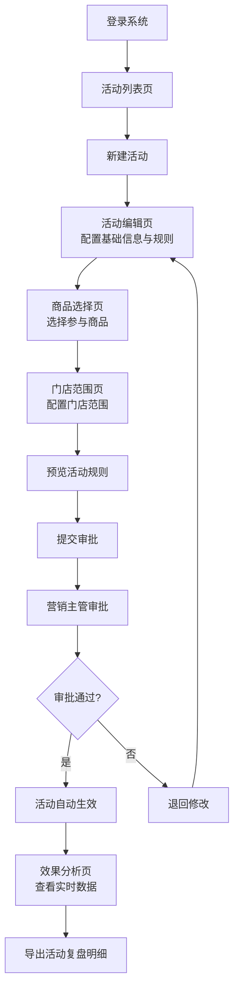
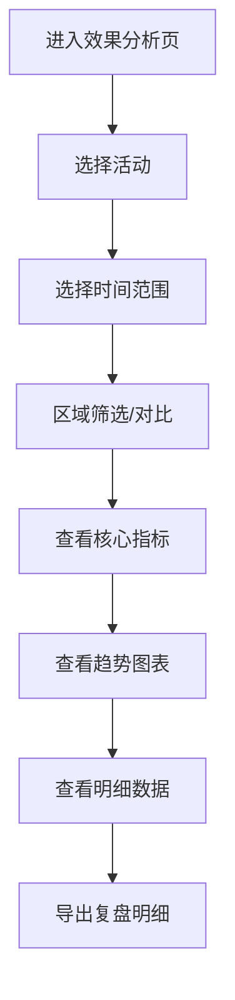

## 1. 产品概述

智慧零售促销活动 Web 管理后台是面向零售运营人员的一站式活动配置与效果分析平台，解决传统促销活动配置繁琐、效果追踪不及时、数据复盘困难等问题。通过直观的可视化界面，运营人员可快速创建和管理各类营销活动，实时监控活动执行效果，并基于数据进行智能决策。

- **核心目标**：提升运营效率 60%，缩短活动上线周期，实现活动全生命周期数字化管理
- **目标用户**：零售运营专员、营销策划人员、门店管理人员、数据分析人员

## 2. 核心功能

### 2.1 用户角色

| 角色 | 注册方式 | 核心权限 |
|------|----------|----------|
| 运营专员 | 企业账号登录 | 创建/编辑活动、提交审批、查看活动列表 |
| 营销主管 | 企业账号登录 | 审批活动、暂停/恢复活动、查看效果分析 |
| 数据分析师 | 企业账号登录 | 查看效果分析、导出复盘明细、区域筛选分析 |

### 2.2 功能模块

1. **活动列表页**：活动概览、多维度筛选、活动状态管理、复制历史活动、快速操作入口
2. **活动编辑页**：活动基础信息配置、活动类型选择（满减/折扣/赠品）、规则配置、会员等级限制、规则预览、提交审批
3. **商品选择页**：商品搜索、分类筛选、批量选择、已选商品管理、商品排除配置
4. **门店范围页**：门店树状选择、区域筛选、批量排除、门店搜索、范围预览
5. **效果分析页**：销售额趋势、客单价分析、核销次数统计、区域筛选对比、数据导出

### 2.3 页面详情

| 页面名称 | 模块名称 | 功能描述 |
|----------|----------|----------|
| 活动列表 | 顶部筛选区 | 按活动类型、状态、时间范围、关键字搜索筛选 |
| 活动列表 | 活动卡片列表 | 展示活动名称、类型、时间、状态、核心指标，支持快速操作 |
| 活动列表 | 批量操作栏 | 批量暂停、批量恢复、批量复制 |
| 活动列表 | 操作列 | 查看详情、编辑、暂停/恢复、复制、删除 |
| 活动编辑 | 基础信息配置 | 活动名称、活动描述、起止时间选择、活动优先级 |
| 活动编辑 | 活动类型配置 | 满减规则（阶梯满减）、折扣规则（会员专属折扣）、赠品规则（满赠条件） |
| 活动编辑 | 会员等级限制 | 多选会员等级、等级标签展示、限制说明 |
| 活动编辑 | 规则预览区 | 实时生成活动规则文案、一键复制规则、预览最终效果 |
| 活动编辑 | 提交审批 | 审批备注、审批流程展示、提交/保存草稿 |
| 商品选择 | 商品筛选区 | 分类树、价格区间、库存状态、关键字搜索 |
| 商品选择 | 商品列表区 | 商品卡片展示、SKU 详情、批量选择、分页加载 |
| 商品选择 | 已选商品栏 | 已选数量统计、批量移除、分类展示 |
| 门店范围 | 区域树状图 | 省-市-区层级选择、区域全选/反选 |
| 门店范围 | 门店列表 | 门店名称、地址、状态、搜索过滤 |
| 门店范围 | 排除门店 | 单独排除指定门店、排除原因备注 |
| 门店范围 | 范围统计 | 已选区域数、门店数、排除门店数 |
| 效果分析 | 核心指标看板 | 总销售额、客单价、核销次数、ROI 核心指标卡片 |
| 效果分析 | 趋势图表 | 销售额趋势图、客单价走势图、核销次数柱状图 |
| 效果分析 | 区域筛选 | 按区域维度筛选、多区域对比分析 |
| 效果分析 | 明细表格 | 活动明细数据、支持导出 Excel/CSV |
| 效果分析 | 导出功能 | 自定义导出字段、导出进度展示、下载链接 |

## 3. 核心流程

### 3.1 活动创建主流程

运营人员登录系统后，首先在活动列表页点击"新建活动"，进入活动编辑页配置基础信息和活动规则。系统实时生成规则预览供运营人员确认。接着依次配置参与商品和门店范围，所有配置完成后提交审批。营销主管在活动列表中审批通过后，活动按预设时间自动生效。活动期间运营人员可在效果分析页查看实时数据，活动结束后可导出复盘明细。

### 3.2 效果分析流程

## 4. 用户界面设计

### 4.1 设计风格

- **主色调**：深邃蓝 `#1E3A5F` 作为主色，代表专业与信赖
- **辅助色**：活力橙 `#FF6B35` 强调操作按钮，数据绿 `#22C55E` 表示增长，警示红 `#EF4444` 提醒异常
- **中性色**：纯白背景 `#FFFFFF`，浅灰 `#F8FAFC` 区分区块，深灰 `#334155` 正文文字
- **按钮风格**：极简胶囊形按钮，主按钮采用深邃蓝配白色文字，hover 状态有微妙的光晕效果
- **字体**：标题使用 "Noto Sans SC" 600-700 字重，正文使用 400-500 字重，数字使用等宽字体提升可读性
- **布局风格**：左侧固定导航栏 + 顶部操作区 + 主体内容区的经典后台布局，大量留白配合精致卡片
- **图标风格**：统一线性风格图标， stroke 宽度 1.5px，颜色与主色调一致

### 4.2 视觉特色

- **卡片设计**：采用分层阴影，hover 时卡片轻微上浮并增强阴影，营造层次感
- **数据可视化**：使用渐变色面积图展示销售额趋势，自定义数据点动画
- **状态标签**：不同活动状态使用不同配色的圆角标签，带有 subtle 背景色
- **空状态**：采用精心设计的空状态插画和引导文案
- **动效**：页面切换使用淡入淡出 + 微位移，数据加载使用骨架屏，按钮点击有缩放反馈

### 4.3 页面设计概览

| 页面名称 | 模块名称 | UI 元素 |
|----------|----------|----------|
| 活动列表 | 顶部筛选区 | 下拉选择器、日期范围选择器、搜索框、新建按钮 |
| 活动列表 | 活动卡片列表 | 活动标题卡、状态标签、指标数据、操作按钮组 |
| 活动编辑 | 规则配置区 | Tab 切换（满减/折扣/赠品）、表单输入框、数字输入框带单位 |
| 活动编辑 | 规则预览区 | 右侧固定预览面板，仿手机端卡片展示最终效果 |
| 商品选择 | 商品列表 | 左右分栏布局，左侧分类树，右侧商品网格卡片 |
| 门店范围 | 区域选择 | 树状选择器，节点带复选框，层级缩进展示 |
| 效果分析 | 指标看板 | 大数字指标卡，带环比增长箭头和百分比 |
| 效果分析 | 图表区 | 可交互图表，支持图例筛选、数据点悬浮提示 |

### 4.4 响应式设计

- **桌面端优先**：针对 1920x1080 及以上分辨率优化，适配 1280px 最小宽度
- **侧边栏**：支持折叠收起，展开 240px，收起 64px，hover 展开二级菜单
- **表格响应式**：小屏幕下横向滚动，关键列固定
- **触控优化**：按钮最小点击区域 44x44px，移动端适配下拉刷新和左滑操作

### 4.5 交互细节

- **表单验证**：实时校验，错误提示采用内联红色文字，输入框描红
- **加载状态**：数据请求时展示骨架屏，按钮点击展示 loading 状态
- **确认对话框**：重要操作（如暂停活动）展示二次确认模态框
- **成功提示**：操作成功后右上角展示 3 秒自动消失的成功提示
- **表格交互**：行 hover 高亮，支持多行选择，列宽可拖拽调整

## 5. 非功能需求

### 5.1 性能要求

- 首屏加载时间 < 2 秒
- 页面切换时间 < 300ms
- 表格支持 10000 条数据流畅滚动（虚拟滚动）
- 图表渲染 < 500ms

### 5.2 数据安全

- 所有操作记录操作日志
- 敏感数据脱敏展示
- 权限控制精确到按钮级别
- 导出数据添加水印

### 5.3 可维护性

- 组件粒度适中，复用率 > 60%
- TypeScript 类型覆盖率 100%
- 关键逻辑添加注释
- 统一的代码风格规范
